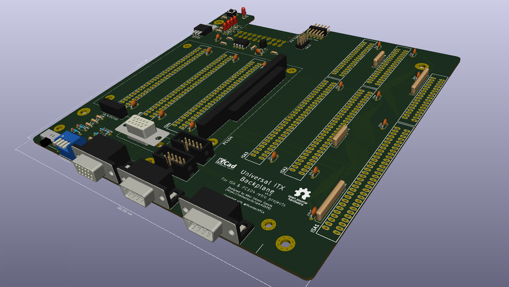

# Universal ITX BackPlane

This backplane is initially intended to be used with Sergey Kiselev's Micro8088 or xi8088 PC clones, among others system powered by x86 architecture. However, other old systems could also be developed using FPGAs built or adapted to ISA or PC / 104 type slots, plus other accessories based on these.

More information of this project in my Hackaday account: https://hackaday.io/project/175340-universal-itx-backplane

The PCB has several I / O connectors common to all projects:

* VGA + MonochromeVGA integrated
* 2 x DB9 ports to be used as serial ports or as joysticks

Additionally, each project can also add a Hat I / O board by adding other specific connectors. For example, an old PC based on a PC / 104 slot could add PS / 2 ports, IDE44 2.0mm connector to connect an external HD or CF, etc ... it must be taken into account that internally the Hat I / O board does not have of a lot of space, several holes have been placed to fasten it to the backplane.

Notice: The project is still in the prototype phase, the first version has not yet been tested.

# Version 1.0

First version of project

Coworked with @MonotechPCs (Twitter profile)

* 4 Layer Mini-ITX board
* 3 x ISA 8 / 16 bits slots
* 1 x PC104 8 / 16 bits slot
* 3 x ISA 8 bits slots
* I/O shield with MonochromeVGA integrated, VGA, and 2 x DB9 connectors

